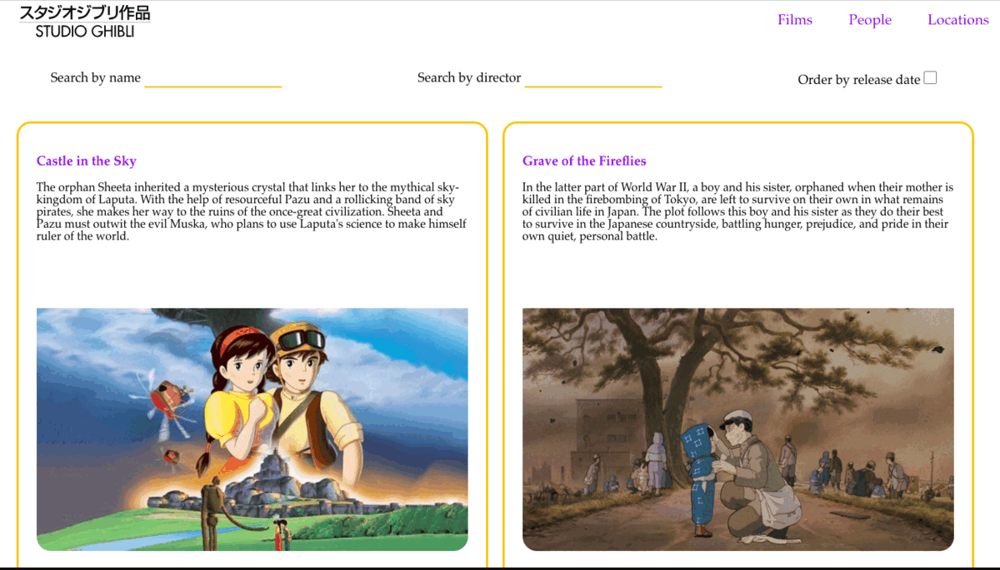

# Frontend Test

## Sumário

- [Frontend Test](#frontend-test)
  - [Sumário](#sumário)
  - [Sobre este projeto](#sobre-este-projeto)
    - [O que foi desenvolvido](#o-que-foi-desenvolvido)
    - [Demonstração da aplicação](#demonstração-da-aplicação)
    - [Tecnologias utilizadas](#tecnologias-utilizadas)
  - [Execução da aplicação](#execução-da-aplicação)
    - [Pré-requisitos](#pré-requisitos)
    - [Instalação das dependências e execução](#instalação-das-dependências-e-execução)
  - [Autoria](#autoria)

## Sobre este projeto

O projeto desenvolvido em React, é uma página que permite consulta a dados da [API's dos Estudios Ghibli](https://ghibliapi.herokuapp.com/).

### O que foi desenvolvido

Desenvolvida aplicação utilizando React que possui funcionalidades de busca na API dos Estudios Ghibli. Através da página é possível acessar a lista de filmes, buscar pelo nome ou diretor e também fitrar pelos filmes mais recentes.

Também é possível listar personagens e por locações, e buscá-los pelo nome.

### Demonstração da aplicação



### Tecnologias utilizadas

- React v18
- React router v5
- CSS
- ESlint

## Execução da aplicação

### Pré-requisitos

- Node.js versão 16

### Instalação das dependências e execução

Para rodar a aplicação localmente, faça o clone do repositório e entre na pasta:

```
git clone https://github.com/ligia-arcanjo/frontend-test.git
cd frontend-test
```

Instale as dependências com o comando:

```
npm install
```

E execute a aplicação com o comando:

```
npm start
```

## Autoria

Ligia Arcanjo Gonçalves

[](https://www.linkedin.com/in/ligiaarcanjo/)
